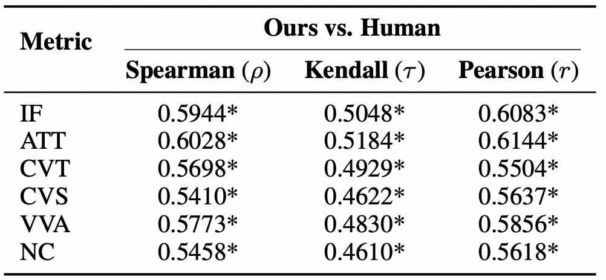

# MCScript: Benchmarking Realistic Video Script Creation from Multimodal Long Contexts

**Huanran Hu, Zihui Ren, Dingyi Yang, Liangyu Chen, Qixiang Gao, Tiezheng Ge, Qin Jin**

## Overview

We introduce **Multimodal Context-to-Script Creation (MCSC)**, a novel task requiring models to generate structured, production-ready video scripts from redundant multimodal long contexts containing both relevant and distracting materials.

Our main contributions are as follows:

1. **New Task & Formulation.** We formalize the MCSC task, which unifies material selection, narrative planning, and shot-level script generation into a single end-to-end pipeline, bridging the gap between multimodal understanding and creative video production.

2. **Large-Scale Dataset.** We construct **MCScript**, a large-scale dataset comprising 11K+ videos with structured script annotations. The evaluation suite **MCSC-Bench** covers both Chinese advertisement (MCSC-ZH) and cross-domain generalization settings including English ads, tutorials, and vlogs (MCSC-GEN).

3. **Comprehensive Evaluation Framework.** We design a multi-dimensional evaluation protocol combining rule-based metrics (Err, Rep, ΔT) with LLM-based scoring across six quality dimensions, and train an open-source Evaluator Model that achieves strong agreement with human judgments.

4. **Extensive Benchmarking.** We systematically evaluate a wide range of proprietary and open-source multimodal LLMs, revealing key challenges in long-context reasoning, material filtering, and narrative coherence. Our fine-tuned MCSC-8B-RL model demonstrates competitive performance against much larger models.

## Data Construction Pipeline

Overview of the MCScript dataset construction. Video materials are drawn from a large video pool.

## Dataset Statistics

(a) Distribution of total video duration. (b) Distribution of shot duration. (c) Word cloud of video types in MCSC-Bench.

## Multi-Dimensional Evaluation

Multi-dimensional evaluation on MCSC-Bench (rescaled by maximum and minimum for better visualization) shows a clear performance ladder across models.

## Evaluator–Human Agreement

We validate the reliability of our Evaluator Model by measuring agreement with human judgments using Spearman's ρ (rank), Kendall's τ (rank), and Pearson's r (value). \* denotes p-value < 0.001, indicating statistical significance.

## Full Results on MCSC-GEN

Due to page limits in the main paper, we only report partial MCSC-GEN results. Below we list the complete performance of all evaluated models on MCSC-GEN.

## Long-Context Stress Test

To examine model robustness under flexible demands, we conduct a comprehensive long-context stress test from both input and output perspectives. Since ads provide sufficient available material, this stress test is specifically evaluated on MCSC-ZH.

**Input-side settings:**
- **Input ×2:** Increases the average number of shots to 12.43 while maintaining the 4:1 Available-to-Distractor ratio.
- **Noise 1:1:** Increases distractor materials to match the number of available materials.

**Output-side settings:**
- Models are required to produce scripts with **Duration ×2** and **Duration ×4** relative to the target length.

To provide a holistic assessment and discourage degenerate strategies (e.g., trivially short outputs yielding low error rates), we define an Overall Score:

$$\text{Overall} = (1 - Err) \times (1 - Rep) \times \frac{1}{1 + \Delta T}$$

which jointly penalizes material misuse, repetition, and duration deviation. The continuous penalty term 1/(1+ΔT) prevents the factor from collapsing to zero when ΔT fluctuates significantly, while Err and Rep are guaranteed to remain positive by their respective definitions.

**Analysis.** Performance decreases under most stress settings. Qwen3-VL-8B exhibits notable sensitivity to both input noise and output length. Qwen2.5-VL-72B is relatively robust to increased input noise but degrades substantially when longer outputs are required. In contrast, Gemini-2.5-Pro shows more stable performance across all dimensions. Overall, sustaining effective material selection and planning over extended input and output horizons remains challenging for current MLLMs.

## Video Generation Case Study

Qualitative analysis of downstream video generation from model-produced scripts.

## Supplementary Material

For more details on dataset annotation, human evaluation, and additional case studies, please refer to [supplementary.pdf](supplementary.pdf).
