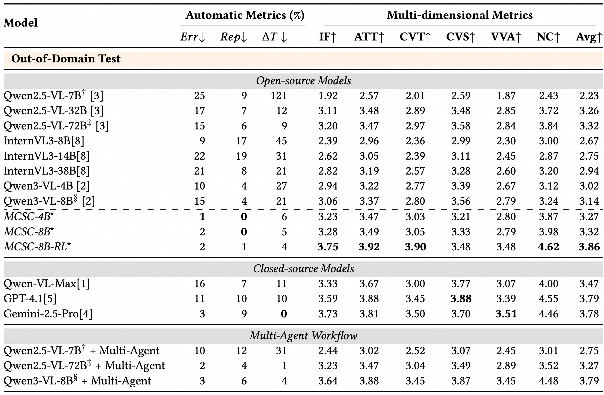

# MCSC-Bench: Multimodal Context-to-Script Creation for Realistic Video Production

**Huanran Hu, Zihui Ren, Dingyi Yang, Liangyu Chen, Qixiang Gao, Tiezheng Ge, Qin Jin**

Renmin University of China, Alibaba Group, Nanyang Technological University

## Contents

- [Supplementary Material](#supplementary-material)
- [MCSC-Bench Release 📢](#mcsc-bench-release-)
  - [In-Domain Test](#in-domain-test)
  - [Out-Of-Domain Test](#out-of-domain-test)
  - [Train](#train)
  - [Eval](#eval)
- [Models](#models)
- [Additional Main Results](#additional-main-results)
- [License, Ethics, and Access](#license-ethics-and-access)


##  Supplementary Material
For more details on dataset annotation, human evaluation, additional case studies, etc, please refer to [supplementary material](supplementary.pdf).

## MCSC-Bench Release :loudspeaker:

Download link: https://huggingface.co/datasets/huanranhu-ruc/MCSC.

### In-Domain Test

We provides pre-extracted **Qwen3-VL-8B** visual features including two formats: (ViT output before the Merger and output after the Merger),  and **Qwen2.5-VL-7B** (ViT output). Features are stored in safetensors format, enabling inference without raw video files or the Vision Encoder.

#### Quick Start

**1. Clone the repository**

**2. Install dependencies**

We recommend Python ≥ 3.10 and CUDA ≥ 12.1.

```bash
# Create a virtual environment (recommended)
conda create -n mcsc python=3.10 -y
conda activate mcsc

# Install PyTorch (adjust for your CUDA version, see https://pytorch.org)
pip install torch torchvision --index-url https://download.pytorch.org/whl/cu121

# Install flash-attn (requires CUDA toolkit)
pip install flash-attn --no-build-isolation

# Install other dependencies
pip install -r requirements.txt
```
> For Qwen3-VL, `transformers==4.57.1` is recommended.
> For Qwen2.5-VL, `transformers==4.51.3` is recommended.

3. Download the data: Download the pre-extracted features from the link below and unzip: https://huggingface.co/datasets/huanranhu-ruc/MCSC/In-Domain_test.

4. Run inference
`scripts/infer.py` is for performing a sample inference, using **Qwen3-VL-8B** Merger output. You can custimze prompts in `prompt/compose.py`.

```bash
python script/infer.py \
    --video_id 286638572610 \
    --features_root $FEATURES_DIR \
    --all_input_json ./In-Domain_test/input.json \
    --model_name Qwen/Qwen3-VL-8B-Instruct \
    --max_new_tokens $MAX_NEW_TOKENS  \
    --output_path $OUTPUT_PATH \
    --device cuda
```

### Out-Of-Domain Test

In Out-Of-Domain_test, we provide general OOD test set. It is designed for direct inference. Each sample contains frames from multiple video clips along with structured textual inputs. Download [Out-Of-Domain_test/frames.zip](https://huggingface.co/datasets/huanranhu-ruc/MCSC/blob/main/Out-Of-Domain_test/frames.zip) and unzip it to the frames/ directory. 
You can also customize interleaved image-text prompt, using name_image_list (interleaved clip IDs and frame paths), video_material (clip inventory with durations), text_material (textual reference), and instruction (user instruction) in `Out-Of-Domain_test/input.json`.

### Train
We provides pre-extracted **Qwen3-VL-8B** visual features (ViT output before the Merger):
https://huggingface.co/datasets/huanranhu-ruc/MCSC/tree/main/train

Fine-tune Qwen3-VL (Merger + LLM) using pre-extracted ViT features. The ViT encoder is frozen, so training only updates the **Merger** and **LLM** — significantly reducing GPU memory and compute. The following code is a simple example for reference.

#### Prerequisites

```bash
pip install transformers==4.57.1 torch>=2.6.0 deepspeed>=0.16.0 \
            safetensors pyyaml flash-attn tensorboard
```

#### Directory Structure

```
project_root/
├── prompt/
│   └── compose.py              # PREFIX_PROMPT, SUFFIX_PROMPT
├── train/
│   ├── train.py                # Main training script
│   ├── dataset.py              # Dataset & DataCollator
│   ├── config.yaml             # All configurations
│   ├── ds_config.json          # DeepSpeed ZeRO-2 config
│   ├── input.json          # DeepSpeed ZeRO-2 config
│   └── run.sh                  # Launch script
├── {feature_root}/             # Pre-extracted features
│   ├── {sample_id}/
│   │   ├── features/
│   │   │   ├── 1_1/000001/features.safetensors
│   │   │   └── ...
│   │   └── gt_script.json      # Ground truth script
│   └── ...
```

#### Quick Start


1. **Edit config** — update paths in `train/config.yaml`:
   ```yaml
   data:
     input_json: "/path/to/input.json"
     feature_root: "/path/to/feature_root"
   ```

2. **Run training** (8x A100-80GB):
   ```bash
   # From project root
   cd /path/to/project_root
   bash train/run.sh
   ```
   Or launch manually:
   ```bash
   deepspeed --num_gpus=8 train/train.py --config train/config.yaml
   ```


max_frames_per_video: Max frames per video; uniformly sampled if exceeded.
max_seq_length: Max token length; longer sequences are truncated


Prompts are loaded from `prompt/compose.py` by default. To override, uncomment the `prompt:` section in `config.yaml`.

### Eval

#### Automatic Rule-based Metrics


```bash
python script/eval_rule.py \
  --script    path/to/generated_script.json \
  --metadata  In-Domain_test/metadata.json \
  --sample_id 286638572610 \
  --output    path/to/result.json
```

where `--script` is the generated script JSON file, `--metadata` is the metadata file containing distractor clip IDs and target duration for each sample, `--sample_id` specifies which sample to evaluate, and `--output` is the path to save the result. The output is a JSON file with three fields: `Err`, `Rep`, and `T` (all lower is better).


#### Multi-dimensional Metrics

We use our evaluator (based on Qwen2.5-VL-7B-Instruct) as the evaluation judge to score a generated script across **6 dimensions**. 
Download our [evaluator model](https://huggingface.co/huanranhu-ruc/MCSC_evaluator).

For each dimension, the model receives [Qwen2.5-VL pre-extracted features](https://huggingface.co/datasets/huanranhu-ruc/MCSC/tree/main/In-Domain_test/Qwen2.5-VL-7B), the text/video materials, user instruction, and the generated script, then outputs an analysis along with a score from 1 to 5. All 6 scores and their raw responses are saved into a single JSON file.
> For Qwen2.5-VL, `transformers==4.51.3` is recommended.

```bash
python scripts/eval_multi_dimension.py \
    --video_id 286638572610 \
    --features_root $FEATURES_DIR \
    --all_input_json ./In-Domain_test/input.json \
    --model_name path_to_our_evaluator \
    --max_new_tokens 4096 \
    --script_path ./path/to/script.json \
    --output_path ./path/to/eval_result.json \
    --device cuda
```

## Models

Our Evaluator Model:

https://huggingface.co/huanranhu-ruc/MCSC_evaluator

Our Trained Model on the MCSC-Bench train set: 

MCSC-8B: https://huggingface.co/huanranhu-ruc/MCSC-8B


## Additional Main Results

### Data Construction Pipeline

Overview of the MCSC-Bench dataset construction. Video materials are drawn from a large video pool.


### Multi-Dimensional Evaluation

Multi-dimensional evaluation on MCSC-Bench (rescaled by maximum and minimum for better visualization) shows a clear performance ladder across models.


### Full Results on Out-of-Domain Test

Due to page limits in the main paper, we only report partial results. Below we list the complete performance of all evaluated models.




## License, Ethics, and Access

This dataset is released under the CC BY-NC-ND 4.0 License, with additional restrictions. Specifically: (1) Attribution — proper credit must be given when using this dataset; (2) NonCommercial — only academic and research use is permitted; (3) NoDerivatives & No Redistribution — the dataset may not be redistributed, remixed, or adapted without prior written consent. We adopt this license to protect source data privacy and comply with upstream platform terms of service. The accompanying source code is released under the MIT License.

This research was conducted in strict adherence to the Code of Ethics and Professional Conduct. All data used in this work derived from publicly available websites and does not contain personally identifiable information or offensive content. For human evaluation, the annotators we recruited possess a high level of education. They were fairly compensated for their time and effort in rating the generated scripts according to our multi-dimensional evaluation criteria.
By downloading or using the MCSC-Bench dataset, you agree to all the following terms.

### Academic Use Only
This dataset is available for academic research purposes only. Any commercial use is strictly prohibited.

### No Redistribution Without Permission
You may not redistribute the dataset in any form without prior written consent from the authors.

### Privacy Protection
Chinese data is derived from e-commerce videos under authorized institutional access. All visual content is released exclusively as de-identified features extracted via the frequently-used vision encoders (e.g., Qwen3-VL-8B, Qwen2.5-VL-7B); no raw images or videos are distributed for privacy reasons. Researchers requiring features from alternative encoders may contact us at [huanranhu@ruc.edu.cn] for assistance.

### Copyright
Out-Of-Domain test set contains sampled frames from publicly available YouTube and TikTok videos. We reference the Vript dataset for video selection; all video content is  sourced from public platforms. We respect the privacy of personal information of the original source. If you are a copyright holder and believe any content infringes your rights, please contact [huanranhu@ruc.edu.cn].

### Disclaimer
You are solely responsible for legal liability arising from your use of this dataset. The authors reserve the right to modify or terminate access at any time and shall not be liable for any damages arising from its use.
