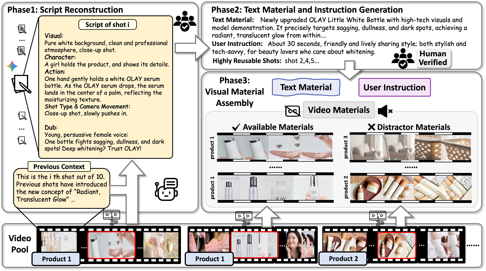
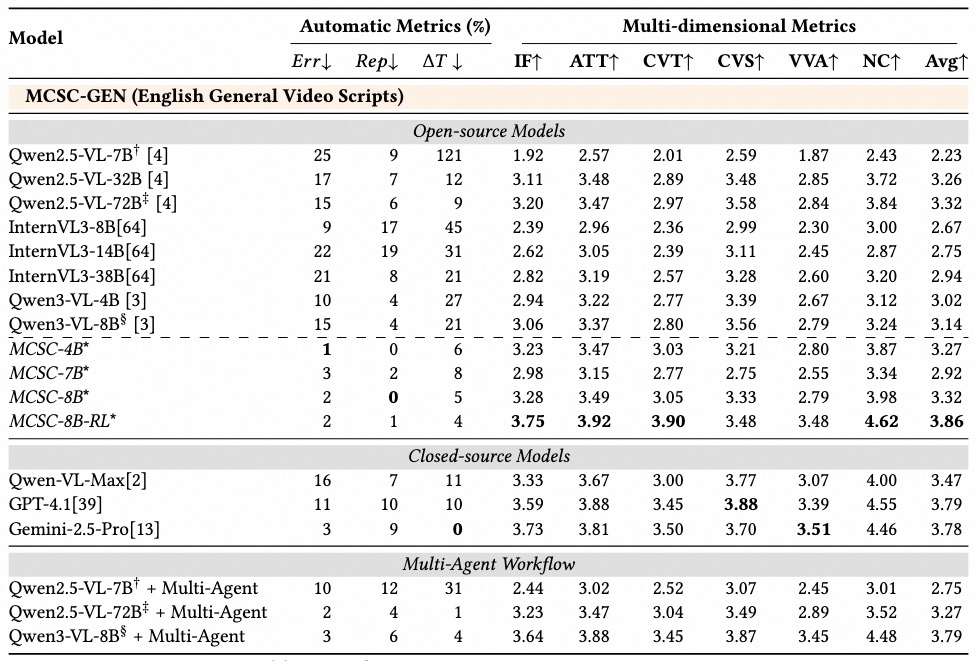
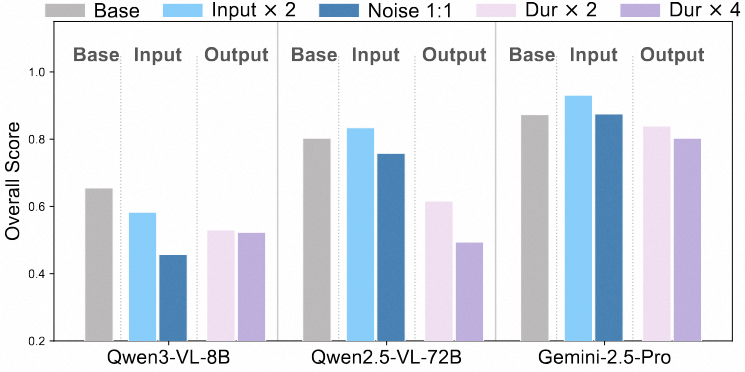

# MCSC-Bench: Multimodal Context-to-Script Creation for Realistic Video Production

**Huanran Hu, Zihui Ren, Dingyi Yang, Liangyu Chen, Qixiang Gao, Tiezheng Ge, Qin Jin**

## Overview
For more details on dataset contruction, Evaluator–Human Agreement, etc, please refer to [Additional Main Results](#additional-main-results).
For more details on dataset annotation, human evaluation, additional case studies, etc, please refer to [supplementary material](supplementary.pdf).


## MCSC-Bench

Download link: https://huggingface.co/datasets/KevinHu0218/MCSC.

### In-Domain set

We provides pre-extracted Qwen3-VL visual features including two formats. Features are stored in safetensors format, enabling inference without raw video files or the Vision Encoder.

#### Quick Start

**1. Clone the repository**

**2. Install dependencies**

We recommend Python ≥ 3.10 and CUDA ≥ 12.1.

```bash
# Create a virtual environment (recommended)
conda create -n mcsc python=3.10 -y
conda activate mcsc

# Install PyTorch (adjust for your CUDA version, see https://pytorch.org)
pip install torch torchvision --index-url https://download.pytorch.org/whl/cu121

# Install flash-attn (requires CUDA toolkit)
pip install flash-attn --no-build-isolation

# Install other dependencies
pip install -r requirements.txt
```

3. Download the data

Download the pre-extracted features from the link below and unzip: https://huggingface.co/datasets/KevinHu0218/MCSC.

4. Run inference
You can customize prefix_prompt and suffix_prompt, using video_material, instruction, and text_material in data1/input.json.
```bash
python scripts/inference_with_features.py \
    --video_id 286638572610 \
    --features_root ./MCSC \
    --all_input_json ./MCSC-ZH/input.json \
    --prefix_prompt "..." \
    --suffix_prompt "..." \
    --max_new_tokens 4096
```

### OOD Test set
In data2, we provide general OOD test set. It is designed for direct inference with any multimodal large language model without pre-extracted features. Each sample contains frames from multiple video clips along with structured textual inputs. Unzip [data2/frames.zip](https://huggingface.co/datasets/KevinHu0218/MCSC/blob/main/data2/frames.zip) and unzip it to the frames/ directory.


## Additional Main Results

### Data Construction Pipeline

Overview of the MCSC-Bench dataset construction. Video materials are drawn from a large video pool.



### Multi-Dimensional Evaluation

Multi-dimensional evaluation on MCSC-Bench (rescaled by maximum and minimum for better visualization) shows a clear performance ladder across models.


### Full Results on Out-of-Domain Test

Due to page limits in the main paper, we only report partial results. Below we list the complete performance of all evaluated models.



### Long-Context Stress Test

To examine model robustness under flexible demands, we conduct a comprehensive long-context stress test from both input and output perspectives. Since ads provide sufficient available material.

**Input-side settings:**
- **Input ×2:** Increases the average number of shots to 12.43 while maintaining the 4:1 Available-to-Distractor ratio.
- **Noise 1:1:** Increases distractor materials to match the number of available materials.

**Output-side settings:**
- Models are required to produce scripts with **Duration ×2** and **Duration ×4** relative to the target length.

To provide a holistic assessment and discourage degenerate strategies (e.g., trivially short outputs yielding low error rates), we define an Overall Score:

$$\text{Overall} = (1 - Err) \times (1 - Rep) \times \frac{1}{1 + \Delta T}$$

which jointly penalizes material misuse, repetition, and duration deviation. The continuous penalty term 1/(1+ΔT) prevents the factor from collapsing to zero when ΔT fluctuates significantly, while Err and Rep are guaranteed to remain positive by their respective definitions.

**Analysis.** Performance decreases under most stress settings. Qwen3-VL-8B exhibits notable sensitivity to both input noise and output length. Qwen2.5-VL-72B is relatively robust to increased input noise but degrades substantially when longer outputs are required. In contrast, Gemini-2.5-Pro shows more stable performance across all dimensions. Overall, sustaining effective material selection and planning over extended input and output horizons remains challenging for current MLLMs.




## License, Ethics, and Access

By downloading or using the MCSC-Bench dataset, you agree to all the following terms.

### Academic Use Only
This dataset is available for academic research purposes only. Any commercial use is strictly prohibited.

### No Redistribution
You may not redistribute the dataset in any form without prior written consent from the authors.

### Privacy Protection
Chinese data is derived from e-commerce videos under authorized institutional access. All visual content is released exclusively as de-identified features extracted via the Qwen3-VL-8B vision encoder; no raw images or videos are distributed for privacy reasons. Researchers requiring features from alternative encoders (e.g., Qwen2.5-VL) may contact us at [huanranhu@ruc.edu.cn] for assistance.

### Copyright and Takedown Policy
MCSC-GEN contains sampled frames from publicly available YouTube and TikTok videos. We reference the Vript dataset for video selection; all video content is  sourced from public platforms. We respect the privacy of personal information of the original source. If you are a copyright holder and believe any content infringes your rights, please contact [huanranhu@ruc.edu.cn].

### Disclaimer
You are solely responsible for legal liability arising from your use of this dataset. The authors reserve the right to modify or terminate access at any time and shall not be liable for any damages arising from its use.

